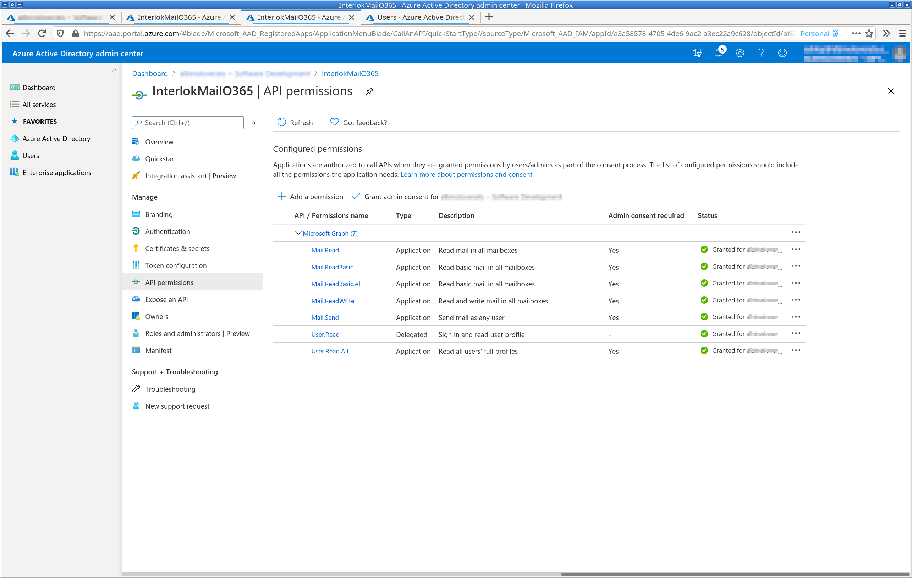
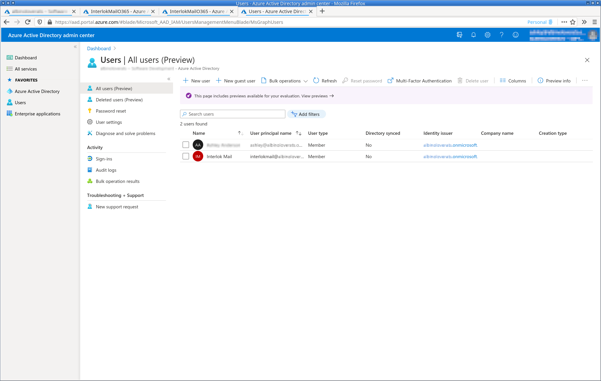

# interlok-azure

     

The suggested name was `didactic-chainsaw`

## Outlook / Office365

### Requirements

* Active Office365 subscription
* An Azure Active Directory application with application the following
  permissions, and with Admin Consent granted:
  - Mail.Read
  - Mail.ReadBasic
  - Mail.ReadBasic.All
  - Mail.ReadWrite
  - Mail.Send
  - User.Read
  - User.Read.All
* A user to send/receive email

The Office365 consumer and producer require the above because:
* Daemon applications can work only in Azure AD tenants
* As users cannot interact with daemon applications, incremental
  consent isn't possible
* Users require an Exchange mailbox to send/receive email, and this
  requires an Office365 subscription

*[See here](https://docs.microsoft.com/en-us/azure/active-directory/develop/scenario-daemon-overview) for an explanation.*

### Application Setup

1. Register an application in the Azure Portal

2. Add a client secret so that the app can identify itself

3. Add the necessary permissions

4. Ensure there is a user with an Exchange mailbox

### Azure Mail Setup

The application ID, tenant ID, client secret and username are all
required and should match those given in the Azure portal. When sending
mail a list of recipients is obviously necessary too.

List of library (JAR) dependencies:

* Microsoft Azure
* Microsoft Graph Core
* Microsoft Graph
* Nimbusds Jose JWT
* Nimbusds oAauth2 OIDC SDK
* Nimbusds Content-Type
* Minidev JSON Smart
* FasterXML Jackson Core
* SquareUp OKHTTP
* SquareUp OKIO
* Google GSON
